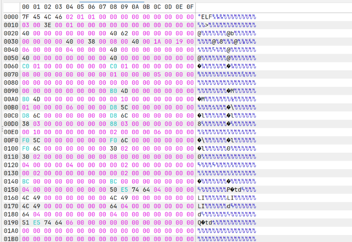
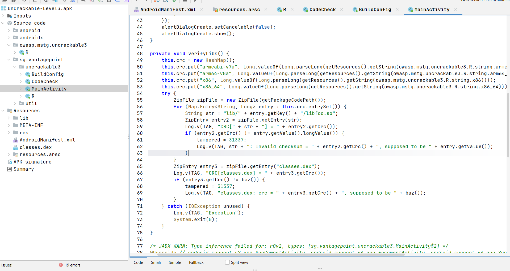
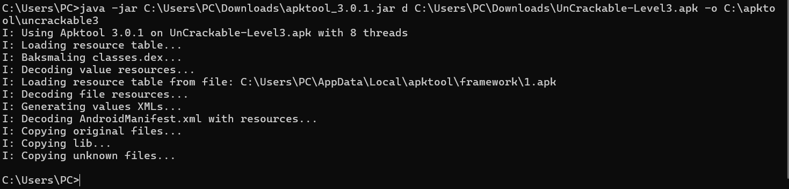
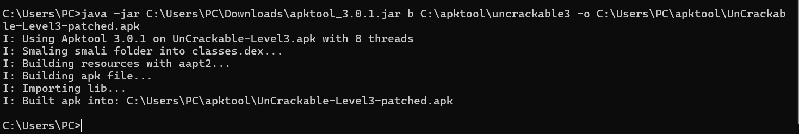
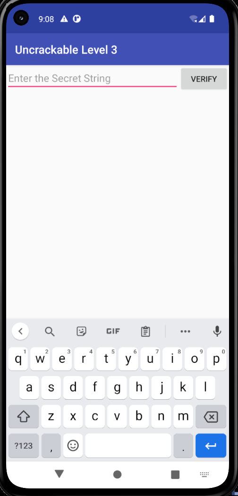
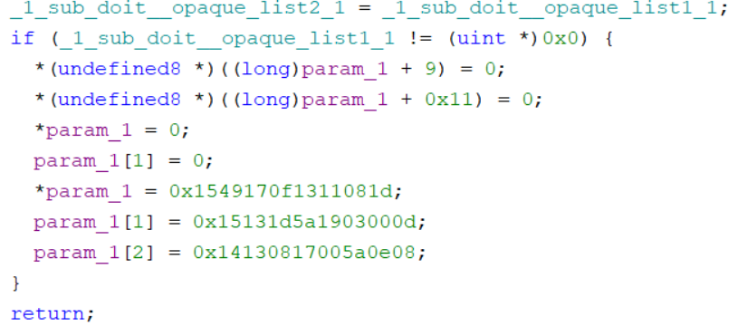
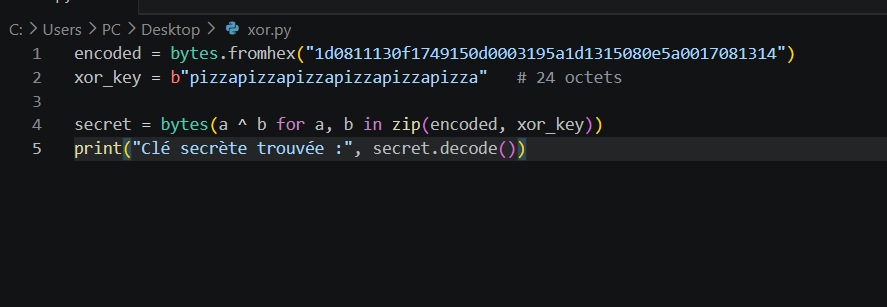
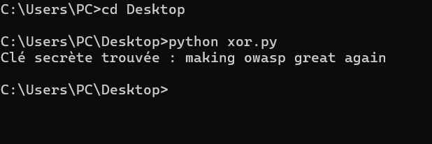
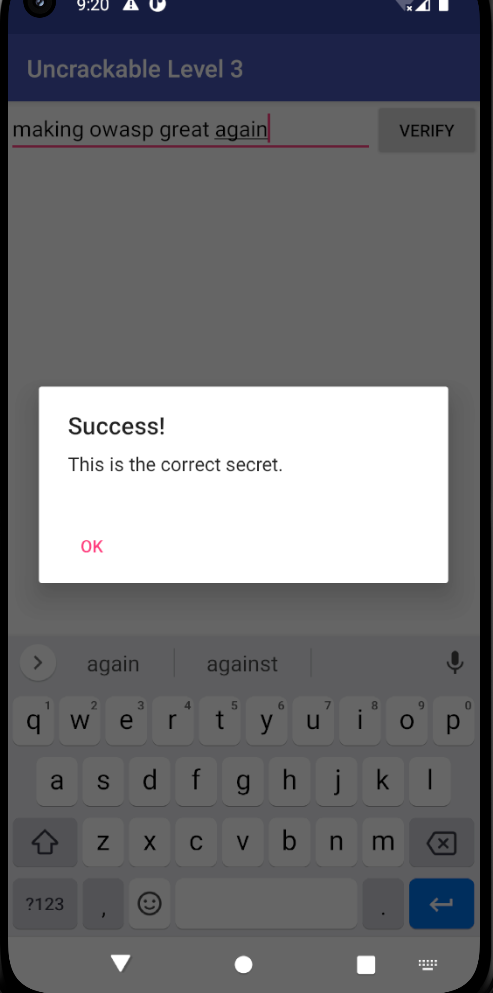

## 1. Objectif du challenge

UnCrackable Level 3 est le troisième et dernier challenge de la série **OWASP MASTG** (Mobile Application Security Testing Guide). Il combine plusieurs mécanismes de protection :

- Détection de root (`checkRoot1/2/3`)
- Détection de debugger (`isDebuggable`)
- Vérification d'intégrité via CRC sur `classes.dex` et `libfoo.so`
- Logique de vérification du secret déplacée dans une **bibliothèque native (JNI)**
- Obfuscation du code natif (boucle LCG + malloc + liste chaînée)
- Stockage de la clé sous forme **XOR-encodée**

L'objectif est de retrouver la chaîne secrète attendue par l'application sans modifier la logique de vérification.

---

## 2. Reconnaissance initiale

Téléchargement de l'APK depuis le repository officiel OWASP MASTG.

Vérification du contenu (`unzip -l UnCrackable-Level3.apk`) :

```
classes.dex
lib/armeabi-v7a/libfoo.so
lib/arm64-v8a/libfoo.so
lib/x86/libfoo.so
lib/x86_64/libfoo.so
AndroidManifest.xml
resources.arsc
```

| Champ | Valeur |
|---|---|
| **Package** | `sg.vantagepoint.uncrackable3` |
| **Activité principale** | `sg.vantagepoint.uncrackable3.MainActivity` |



> Hex dump confirmant que `libfoo.so` est bien un binaire **ELF 64-bit** (signature `7F 45 4C 46` = `.ELF`).

---

## 3. Analyse statique du code Java (JADX)



> Vue JADX-GUI de la méthode `verifyLibs()` dans `MainActivity`.

### Structure du package observée

```
sg.vantagepoint.uncrackable3
├── MainActivity      (UI + détections + chargement natif)
├── CodeCheck         (appelle check_code natif)
├── BuildConfig
└── R

sg.vantagepoint.util
├── RootDetection     (checkRoot1, checkRoot2, checkRoot3)
└── IntegrityCheck    (isDebuggable)
```

### Points clés dans `MainActivity`

| Élément | Rôle |
|---|---|
| `System.loadLibrary("foo")` | Charge `libfoo.so` au démarrage |
| `verifyLibs()` | Calcule le CRC de chaque `libfoo.so` et de `classes.dex`. Si ≠ CRC attendu → flag `tampered = 31337` (`0x7a69`) |
| Bloc `onCreate()` | Combine `checkRoot1/2/3()` + `isDebuggable()` + `tampered != 0` → `showDialog("Rooting or tampering detected.")` puis exit |
| `init(byte[] xorkey)` | Appelle la fonction native `init` avec la clé `"pizzapizzapizzapizzapizz"` (24 octets) |
| `verify()` | Appelle `CodeCheck.check_code(input)` qui délègue au natif |

> **Observation clé :** la logique de comparaison finale n'est **PAS** en Java. Elle est déléguée à la fonction native `check_code` dans `libfoo.so`.

---

## 4. Décompilation et patching Smali (apktool)

### 4.1 Décompilation

```cmd
java -jar apktool_3.0.1.jar d UnCrackable-Level3.apk -o C:\apktool\uncrackable3
```



> Sortie de la commande `apktool d` : baksmaling, decoding resources, copying lib, etc.

### 4.2 Identification du bloc à neutraliser

Dans `smali/sg/vantagepoint/uncrackable3/MainActivity.smali`, méthode `onCreate()`, le bloc suivant doit être court-circuité :

```smali
invoke-static {}, Lsg/vantagepoint/util/RootDetection;->checkRoot1()Z
move-result v0
if-nez v0, :cond_0
...
sget v0, Lsg/vantagepoint/uncrackable3/MainActivity;->tampered:I
if-eqz v0, :cond_1

:cond_0
const-string v0, "Rooting or tampering detected."
invoke-direct {p0, v0}, Lsg/vantagepoint/uncrackable3/MainActivity;->showDialog(...)V

:cond_1
new-instance v0, Lsg/vantagepoint/uncrackable3/CodeCheck;
```

### 4.3 Patch appliqué

Ajout d'un saut inconditionnel `goto :cond_1` juste avant le bloc de vérifications. Cela bypass d'un coup toutes les détections (root, debug, tampering) :

```smali
invoke-virtual {v0, v1}, Lsg/.../MainActivity$2;->execute(...)Landroid/os/AsyncTask;

goto :cond_1     # <-- PATCH AJOUTÉ

invoke-static {}, Lsg/vantagepoint/util/RootDetection;->checkRoot1()Z
... (reste inchangé, mais devient code mort) ...

:cond_1
new-instance v0, Lsg/vantagepoint/uncrackable3/CodeCheck;
```

---

## 5. Rebuild, signature et installation de l'APK patché

### 5.1 Rebuild

```cmd
java -jar apktool_3.0.1.jar b C:\apktool\uncrackable3 ^
    -o C:\Users\PC\apktool\UnCrackable-Level3-patched.apk
```



> Sortie `apktool b` : smaling, building resources, building apk file, importing lib. Build réussi.

### 5.2 Création d'un keystore (mot de passe de l'ancien oublié)

```cmd
"C:\Program Files\Java\jdk-23\bin\keytool.exe" -genkey -v ^
    -keystore my-key.keystore ^
    -alias mykey -keyalg RSA -keysize 2048 -validity 10000 ^
    -storepass android -keypass android ^
    -dname "CN=Test, OU=Test, O=Test, L=Test, S=Test, C=US"
```

### 5.3 Alignement

```cmd
zipalign -p -f -v 4 UnCrackable-Level3-patched.apk UnCrackable-Level3-aligned.apk
```

### 5.4 Signature

```cmd
apksigner sign --ks my-key.keystore ^
    --ks-pass pass:android --key-pass pass:android ^
    --ks-key-alias mykey ^
    --out UnCrackable-Level3-signed.apk ^
    UnCrackable-Level3-aligned.apk
```

### 5.5 Installation

```cmd
adb uninstall sg.vantagepoint.uncrackable3
adb install UnCrackable-Level3-signed.apk
```



> L'application patchée démarre sans déclencher la boîte *"Rooting or tampering detected"* et affiche directement l'écran *"Enter the Secret String"*. **Patch validé.**

---

## 6. Analyse de la bibliothèque native (Ghidra)

### 6.1 Extraction de libfoo.so

ABI cible (émulateur x86_64) :

```cmd
adb shell getprop ro.product.cpu.abi
> x86_64
```

Fichier analysé : `lib/x86_64/libfoo.so`

### 6.2 Import dans Ghidra

- New Project → Import File → `libfoo.so`
- Format : **ELF**
- Analyse automatique (toutes les options par défaut)

### 6.3 Localisation de la fonction cible

**Symbol Tree → Exports → recherche `check_1code`**

Fonction trouvée :

```
Java_sg_vantagepoint_uncrackable3_CodeCheck_check_1code
```

Celle-ci appelle à son tour la fonction interne `FUN_001012c0` (nom auto-généré par Ghidra).

### 6.4 Analyse du pseudo-code de `FUN_001012c0`



> Pseudo-code décompilé par Ghidra montrant la fin de la fonction.

**Structure observée :**

- Une boucle **LCG** (Linear Congruential Generator) qui s'exécute ~80 fois, avec une constante multiplicative `0x33333`. But : créer du bruit pour compliquer l'analyse statique.
- L'allocation d'une **liste chaînée** via `malloc` (`_1_sub_doit__opaque_list1_*`).
- À la toute fin, les vraies données utiles sont écrites dans le buffer `param_1` (passé par `check_code`).

**Code utile à la fin de la fonction :**

```c
if (_1_sub_doit__opaque_list1_1 != (uint *)0x0) {
    *(undefined8 *)((long)param_1 + 9)  = 0;
    *(undefined8 *)((long)param_1 + 0x11) = 0;
    *param_1    = 0;
    param_1[1]  = 0;
    *param_1    = 0x1549170f1311081d;
    param_1[1]  = 0x15131d5a1903000d;
    param_1[2]  = 0x14130817005a0e08;
}
return;
```

Ces 3 quadwords (**24 octets au total**) constituent la **clé XOR-encodée** qui sera comparée à l'entrée utilisateur (après traitement avec la clé `"pizzapizzapizzapizzapizz"`).

---

## 7. Extraction et décodage de la clé secrète (XOR)

### 7.1 Conversion little-endian

Les valeurs étant stockées en **little-endian** sur x86_64, on inverse l'ordre des octets de chaque quadword :

| Quadword | Octets (LE) |
|---|---|
| `0x1549170f1311081d` | `1d 08 11 13 0f 17 49 15` |
| `0x15131d5a1903000d` | `0d 00 03 19 5a 1d 13 15` |
| `0x14130817005a0e08` | `08 0e 5a 00 17 08 13 14` |

**Concaténation (24 octets) :**

```
1d 08 11 13 0f 17 49 15 0d 00 03 19 5a 1d 13 15 08 0e 5a 00 17 08 13 14
```

### 7.2 Script Python de décodage



> Code source du script `xor.py` dans VS Code (5 lignes).

**Fichier `xor.py` :**

```python
encoded = bytes.fromhex("1d0811130f1749150d0003195a1d1315080e5a0017081314")
xor_key = b"pizzapizzapizzapizzapizza"   # 24 octets

secret = bytes(a ^ b for a, b in zip(encoded, xor_key))
print("Clé secrète trouvée :", secret.decode())
```

### 7.3 Exécution

```cmd
cd Desktop
python xor.py
```



> Sortie CMD confirmant le décodage : **`making owasp great again`**.

---

## 8. Validation finale

**Saisie dans l'application :**

- Ouverture de UnCrackable Level 3 (version patchée)
- Saisie dans le champ : `making owasp great again`
- Clic sur **VERIFY**



> Capture finale montrant la boîte de dialogue **"Success! This is the correct secret."**


---

## 9. Conclusion et leçons apprises

### 9.1 Résumé de la chaîne d'attaque

1. **Décompilation Java** → identification des protections superficielles.
2. **Patch Smali** → neutralisation des détections (root/debug/tampering).
3. **Rebuild + signature** → APK fonctionnel avec protections désactivées.
4. **Analyse native (Ghidra)** → repérage de la clé XOR-encodée dans `libfoo.so`.
5. **Décodage Python** → récupération du secret en clair.

### 9.3 Rôle des composants identifiés

| Composant | Rôle |
|---|---|
| `check_code()` | Point d'entrée JNI. Reçoit la chaîne utilisateur, la transforme et la compare au buffer cible. |
| `FUN_001012c0` | Initialise le buffer de référence avec la clé XOR-encodée après une grosse couche d'obfuscation. |
| `tampered` (Java) | Flag positionné par `verifyLibs()` si un CRC ne correspond pas. Lu dans `onCreate()` pour fermer l'app si ≠ 0. |
| `libfoo.so` | Porte la logique secrète et la clé obfusquée. |

### 9.4 Pourquoi le buffer final est la clé du challenge

Toute la logique de vérification se réduit, *in fine*, à un `memcmp` entre :

- `input XOR "pizzapizzapizzapizzapizz"`
- constante en dur dans `libfoo.so`

Récupérer la constante revient donc à inverser **l'unique opération réelle**. Le reste du code natif (obfuscation, listes chaînées, LCG) n'a pas d'incidence sur le résultat et peut être ignoré une fois la fin de la fonction repérée.

---
